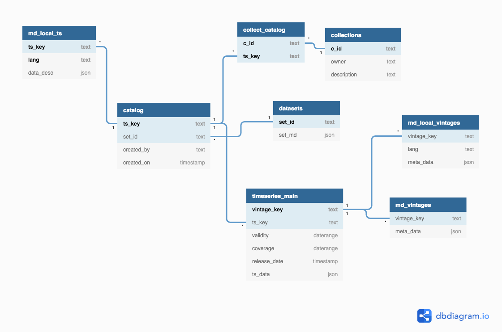

## General Overview




The *vintages* table is the main table that keeps all the different versions of a time series. The *catalog* table holds the stem of a time series identified by *ts_key*. These stems do not hold any observational values but provide a link to *datasets* time series specific descriptions as well as time series specific meta information as opposed to versioned meta data. This avoids redundancy and fosters searching keys by regular expressions in case the *vintages* table is hash partitioned. *Collections* allow users to sets of time series identifiers (keys), in similar fashion as playlists in music apps. Tables with an *md_* prefix store meta information different levels. But having multiple tables the user can choose whether meta information needs to be versioned, too. 

The following sections describe the actions behind standard write and read processes. Due to the fact that not only a time series itself is stored but versions of it as well as comprehensive data descriptions, multiple tables are affected. 


## Storing New Time Series

If an entirely new series is stored it belongs to the *default* dataset unless specified otherwise. Because a catalog entry for the stem does not exist yet, a new *ts_key* is inserted into the catalog. 

Once a *ts_key* is created a first version is inserted into the *timeseries_main* table. The first version is valid from the current ```Sys.Date()``` until an open end. 

## Adding a New Vintage (Version) to an Existing Time Series

In case a *ts_key* already exists in the time series catalog it is **NOT** updated. This is major change compared to previous versions of {timeseriesdb} as versions were not kept by default. With {timeseriesdb} > 1.0 the stem will not be modified. Instead a new version of the time series will be added to the *timeseries_main* table. 

In the process the validity of the previous versions of that time series will be closed (updated) at ```Sys.Date()``` unless another, future date is specified. The new version of the series is inserted into the *timeseries_main* table and its validity is set to start at ```Sys.Date()``` (or the specified future date) enforcing a non-overlapping constraint for time series versions (vintages).


